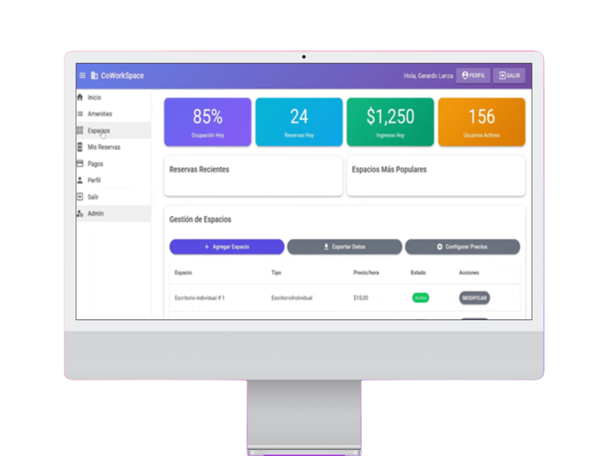
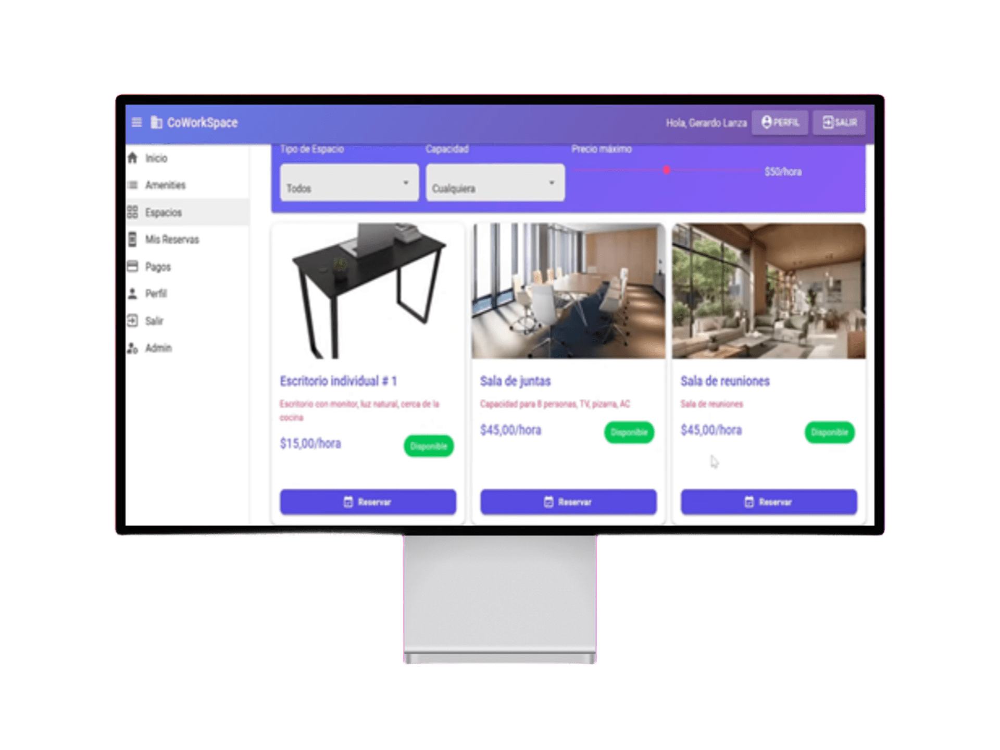
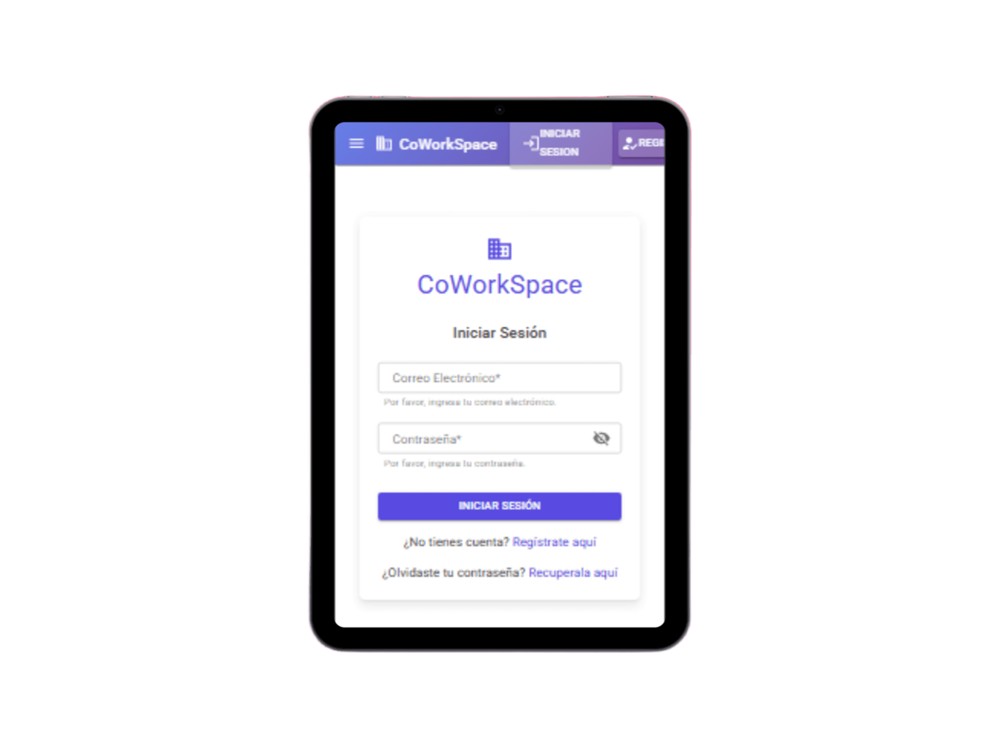
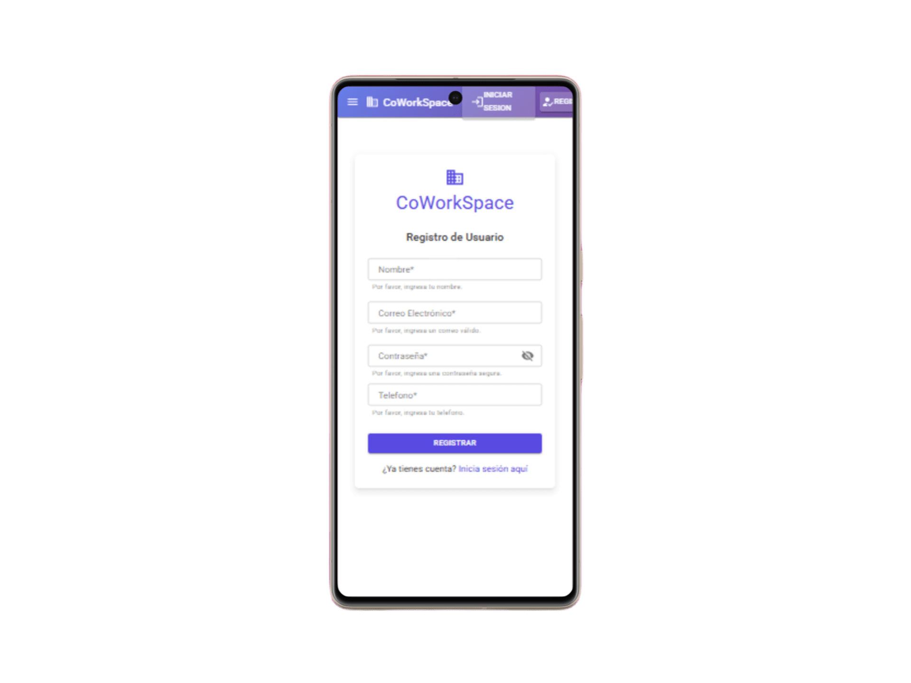
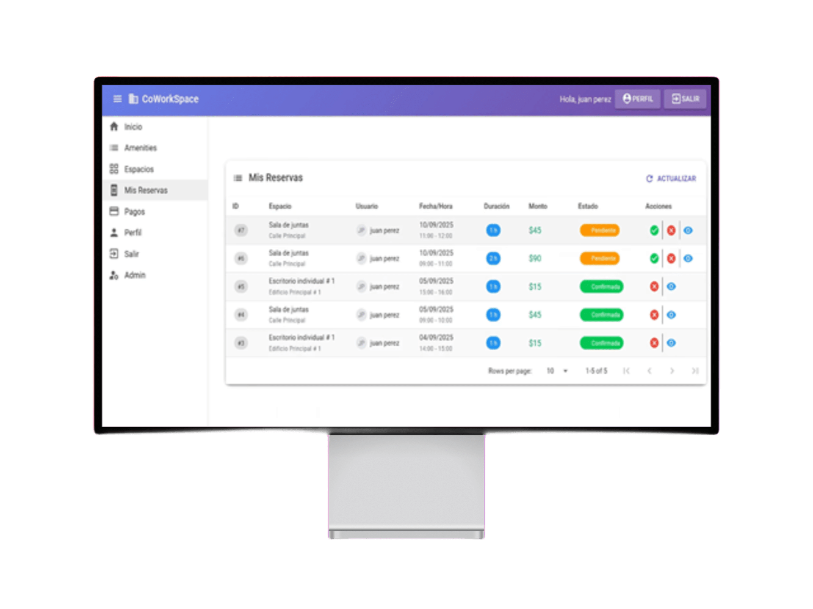
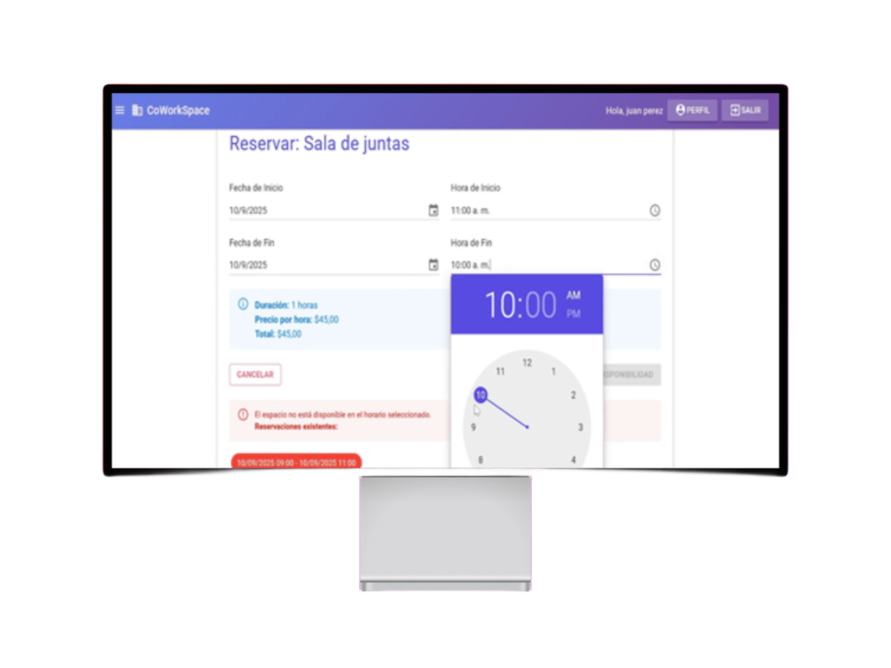

# Coworking

Sistema web para la gestión integral de espacios de coworking, desarrollado con .NET 9 y MudBlazor, implementando una arquitectura N-Capas para garantizar escalabilidad, mantenibilidad y separación de responsabilidades.

## Tabla de Contenidos
* [Características](#características)
* [Capturas de Pantalla](#capturas-de-pantalla)
* [Tecnologías](#tecnologías)
* [Requisitos Previos](#requisitos-previos)
* [Instalación](#instalación)
* [Estructura del Proyecto](#estructura-del-proyecto)
* [Funcionalidades](#funcionalidades)
* [Agradecimientos](#agradecimientos)

## Características

- **Gestión de Espacios**: Administración completa de espacios de trabajo compartidos
- **Sistema de Reservas**: Reserva y gestión de espacios con calendario integrado
- **Arquitectura N-Capas**: Separación clara entre presentación, lógica de negocio y acceso a datos
- **Login con JWT**: Implementa seguridad para registro de usuarios
- **Tecnología .NET 9**: Aprovecha las últimas características del framework
- **Blazor Server**: Experiencia de usuario interactiva y fluida

## Capturas de Pantalla

### Panel de administración


### Explorador de espacios


### Vista Responsivas de inicio y registro



### Lista de reservaciones


### Reservar espacio



## Tecnologías

### Backend
- **.NET 9** - Framework principal
- **C#** - Lenguaje de programación
- **Entity Framework Core** - ORM para acceso a datos
- **ASP.NET Core** - Para APIs y servicios

### Frontend
- **Blazor** - Framework para aplicaciones web interactivas
- **MudBlazor** - Biblioteca de componentes UI basada en Material Design
- **HTML5/CSS3** - Estructura y estilos

### Base de Datos
- **SQL Server**

### Arquitectura
- **Arquitectura N-Capas**
  - Capa de Presentación (UI)
  - Capa de Lógica de Negocio (Business Logic)
  - Capa de Acceso a Datos (Data Access)
  - Capa de Entidades (Entities/Models)

## Requisitos Previos

Antes de comenzar, asegúrate de tener instalado:

- [.NET 9 SDK](https://dotnet.microsoft.com/download/dotnet/9.0) (versión 9.0 o superior)
- [Visual Studio 2022](https://visualstudio.microsoft.com/)
- [SQL Server](https://www.microsoft.com/sql-server)
- [Git](https://git-scm.com/)

## Instalación

### 1. Clonar el repositorio

```bash
git clone https://github.com/brayanhl17/Coworking.git
cd Coworking
```

### 2. Restaurar dependencias

```bash
dotnet restore
```

### 3. Configurar la base de datos

Actualiza la cadena de conexión en `appsettings.json`:

```json
{
  "ConnectionStrings": {
    "DefaultConnection": "Server=(localdb)\\mssqllocaldb;Database=CWKDB2;Trusted_Connection=true;MultipleActiveResultSets=true"
  }
}
```

### 4. Aplicar migraciones

```bash
dotnet ef database update
```

### 5. Ejecutar la aplicación

```bash
dotnet run
```

La aplicación estará disponible en `https://localhost:7223` o `http://localhost:5209`

## Configuración

## Estructura del Proyecto

```
Coworking/
│
├── Cwk.Api/                   # Capa de API REST
│   ├── Controllers/           # Controladores de API
│   ├── Program.cs             # Punto de entrada
│   └── appsettings.json       # Configuración
│
├── Cwk.Application/           # Capa de Aplicación
│   ├── Services/              # Servicios de aplicación
│   ├── DTOs/                  # Objetos de transferencia de datos
│   └── Interfaces/            # Contratos de servicios
│
├── Cwk.Business/              # Capa de Lógica de Negocio
│   ├── Services/              # Servicios de negocio
│   └── Interfaces/            # Contratos de negocio
│
├── Cwk.Domain/                # Capa de Dominio
│   ├── Entities/              # Entidades del dominio
│   └── Interfaces/            # Repositorios e interfaces
│
├── Cwk.Infrastructure/        # Capa de Infraestructura
│   ├── Data/                  # DbContext y configuración
│   ├── Repositories/          # Implementación de repositorios
│   └── Migrations/            # Migraciones de base de datos
│
└── Cwk.Web/                   # Capa de Presentación (Blazor)
    ├── Pages/                 # Páginas Blazor
    ├── Shared/                # Componentes compartidos
    ├── wwwroot/               # Archivos estáticos
    └── Program.cs             # Punto de entrada
```

## Funcionalidades

### Para Usuarios

- **Búsqueda de Espacios**: Encuentra espacios disponibles según tus necesidades
- **Reservas en Tiempo Real**: Sistema de reservas con confirmación instantánea
- **Gestión de Reservas**: Visualiza, modifica y cancela tus reservas
- **Perfil de Usuario**: Administra tu información personal y preferencias
- **Historial**: Consulta el historial completo de reservas

### Para Administradores

- **Dashboard Administrativo**: Panel de control con métricas y estadísticas
- **Gestión de Espacios**: Crear, editar y eliminar espacios de coworking
- **Gestión de Usuarios**: Administrar usuarios y permisos
- **Reportes**: Generación de reportes de ocupación y estadísticas
- **Configuración del Sistema**: Ajustes generales de la aplicación

### Características Técnicas

- **Responsive Design**: Interfaz adaptable a diferentes dispositivos
- **Validación de Datos**: Validaciones en cliente y servidor
- **Notificaciones**: Sistema de notificaciones con Snackbar
- **Manejo de Errores**: Sistema robusto de gestión de errores
- **Seguridad**: Implementación de autenticación y autorización

## Agradecimientos

- **[MudBlazor](https://mudblazor.com/)** - Por proporcionar biblioteca de componentes UI
- **Tecnologers - Canal de Youtube

---

Desarrollado con pasión por [brayanhl17](https://github.com/brayanhl17)
